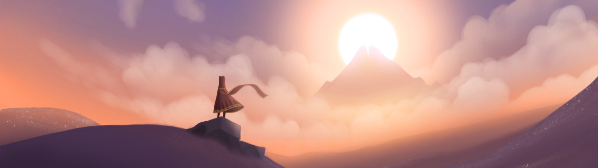

# Code a Man's Learning Journey

## Table of Contents

- [Introduction](#introduction)
- [Programming Languages](#programming-languages)

## Introduction

I think the best way to learn programming is to build projects so this repository is a collection of projects that I have built and resources that I have found useful along the way.

## Programming Languages

- [Go](languages/go/README.md)
